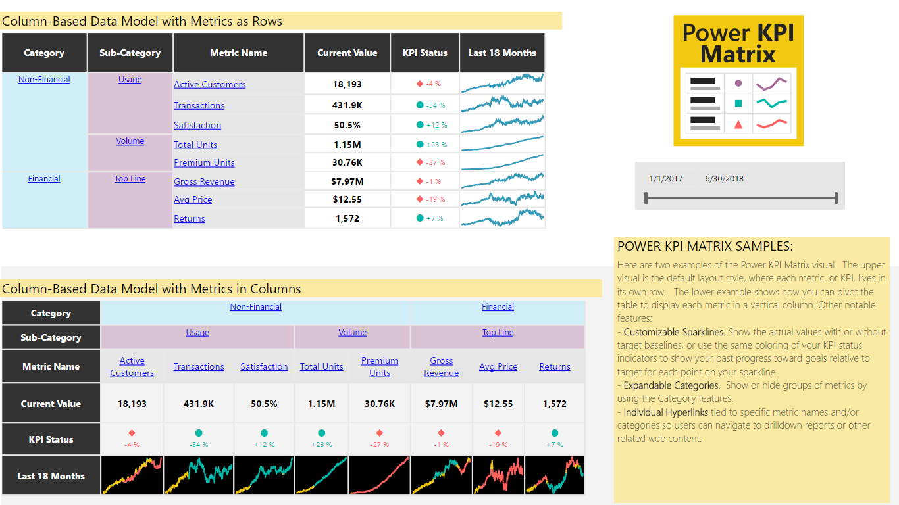

# PowerKPI Matrix

> Monitor balanced scorecards and unlimited number of metrics and KPIs in a compact, easy to read list

# Overview  

Power KPI Matrix enables balanced scorecards in Power BI and displays an unlimited number of metrics and KPIs in a single, customized list. Power KPI Matrix is similar to the Power KPI custom visual in supporting the creation and display of KPI indicator symbols and values along with current and historical trends of actual and target values.

The tabular format of Power KPI Matrix allows for an unlimited number of metrics and KPIs in a single list. While there are several other custom visuals available that also display lists of KPIs, Power KPI Matrix offers a few unique abilities:

Balanced Scorecards. Present different types of metrics and non-additive key performance indicators (KPIs), such as financial, operational, and customer-focused measures, as rows in a single list.

Column-Based and Row-Based Sources. Use your existing data models with minimal transformation. Bind the visual to either column-based metric sources or tables with row-based metrics.

Super flexible and Customize-able. Control fine details such as the font and background colors for each individual cell, row, or column; number formats, types, and precision; line chart colors and styles; row and column heights, widths, and more.

Complete instructions are provided in the sample file. Please download the sample from AppSource.com via a browser by hitting the “Get It Now” button. The “Try a sample” link will then show on the far right side of the screen.

Listing of key features:

- Pivot Output Metrics as Columns or Rows. Pivot the table to display each metric as a row or as a vertical column (see the sample visuals)
- Custom Sparklines. Show the available trend of actual values, with or without target baselines, or use the same coloring of your KPI status indicators to show your past progress toward goals relative to target for each point on your sparkline.
- Expandable Categories. Show or hide groups of metrics by using the Category features. Subtotal values may also be shown, useful for items in a category that are additive in nature.
- Individual Hyperlinks may be tied to metric names and/or categories, enabling end users to navigate to drilldown reports or other related web content.
- KPI Indicators. Choose from various KPI symbols to represent performance relative to a targets in the data model. Define thresholds for colors and symbols and, optionally, use the same colors for the KPI indicator value and sparklines.
- Columns as Rows. Starting with columnar data table, built with different metrics in various columns, map the individual metrics to the desired Actual, Target, and Variance cells within a given row of the output table. This is done by using the "Edit" option available in the ellipses ("...") menu from the upper right corner of the visual.
- Row and Column Sizing. Easily change row heights and column widths by clicking and dragging the row/column borders, similar to Excel.
- Colors, Fonts, and Formats. Granular control of background colors and font colors, sizes, styles, vertical and horizontal grid lines, and more
- Auto Table Formats. Choose from a selection of preset table themes, including alternate row shading
- Current Values and Status of KPIs. The visual always shows the current most current status of the data based on the "As of Date" field. Users may also interact with past dates, such as by including a separate date slicer (see samples).
- Pop-Out Power KPI Chart. Clicking any non-hyperlinked cell launches a Power KPI chart to show full trend details

See also [PowerKPI Matrix at Microsoft AppSource](https://appsource.microsoft.com/en-us/product/power-bi-visuals/WA104381299)